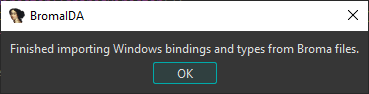
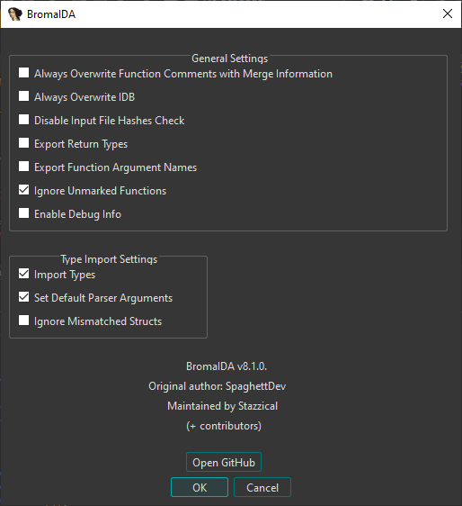

# BromaIDA

Broma support for IDA (now real).

Smartly processes the Broma files from the [Geometry Dash Geode bindings](https://github.com/geode-sdk/bindings) and applies as much data to your IDB as possible.

[](https://github.com/Stazzical/BromaIDA)

## Features

> [!CAUTION]
> The exporting module is unmaintained and incomplete as of now. It is not recommended for use.

- Importing bindings
  - Symbol import for functions on platforms that lack them.
- Importing types (see [Importing Types](#importing-types)). If enabled, will preform the following:
  - Import Broma class members and virtual function tables
  - Import function return types, arguments types and names
  - Attempt to fix the signature of functions guessed by IDA
  - NOTE: Type import is primarily fine-tuned for the latest version of Geometry Dash (2.2081 as of writing). Support for older versions may come in the future.
- Exporting bindings (Currently unmaintained, prone to malfunction)
  - Export function addresses for any platform
  - Export function return types (if enabled, see [BromaIDA Settings](#bromaida-settings))
  - Export function arguments' names (if enabled, see [BromaIDA Settings](#bromaida-settings))

## Requirements

- IDA Pro v7.0+ (v9.2 and v9.3 are fully tested)
- IDAPython
- Python v3.10.0+ (v3.12+ highly recommended)
- Required for importing types:
  - IDAClang

## Installation

1. [Install Python](https://www.python.org/downloads/).
2. Download the release/zip file, or clone the repository.
3. Navigate to the root folder of BromaIDA and run the following command to install the plugin's dependencies:
```
pip install -r requirements.txt
```
4. Copy `BromaIDA.py` and the `broma_ida` folder into the `IDA_DIRECTORY/plugins` directory, where `IDA_DIRECTORY` is the location of your installed IDA Pro.

> In case IDA does not use the appropriate version of Python in the program environment, use the `idapyswitch` program supplied next to IDA in the installation directory to manually change which version of Python is used.

> If you run into any issues installing PyBroma using the standard `requirements.txt` method, you may try following the installation instructions [on the PyBroma repository](https://github.com/prevter/PyBroma).

## Usage

1. Press the `Ctrl-Shift-B` hotkey, or from the Top Bar go through Edit -> Plugins -> BromaIDA (you may need to switch to other subviews) to open the main plugin window.
2. Select your preferred process of importing ~~or exporting~~ bindings. You may also open the 'Settings' menu to change your preferences. See [BromaIDA Settings](#bromaida-settings).
3. Follow all instructions and prompts shown on screen until the process is finished.

## Importing Types

> [!NOTE]
> You no longer need to scrape or supply local STL headers for your binary target. BromaIDA packages pre-configured STL headers out of the box for Android (android32, android64), Mach-O (imac, m1, ios), and Windows.

IDAClang is required for importing types. The option to import types is enabled by default, but may get disabled if you do not have IDAClang available.

The process generates a single `platform_name-binary_name.hpp` file from all the received Broma classes (plus some pre-defined headers), relative to the binary you have opened and the platform it works upon. BromaIDA will then prompt to import the types for you. This is done before bindings are imported to allow the application of the class types to function signatures.

Type importation yields class members and virtual function tables for IDA to resolve in psuedocode decompilations. At times you may need to manually instruct types to variables by yourself as IDA may not automatically infer types.

If type import was done successfully, the finishing pop up should read like this, specifically including the keyword 'types':



## BromaIDA Settings

Settings can be accessed directly from the main popup by clicking the 'Settings' button.

Your preferences are automatically handled by the `platformdirs` library and saved using a Python [shelf](https://docs.python.org/3/library/shelve.html) in your operating system's standard configuration directory (e.g. `~/.config` on Linux/macOS or `AppData\Local` on Windows).



## Acknowledgements

- The [IDAPython API](https://hex-rays.com/products/ida/support/idapython_docs): Powering the entire interface and binary manipulation layer.
- [CallocGD](https://github.com/CallocGD): For creating the original [PyBroma](https://github.com/CallocGD/PyBroma) Python library wrapper for Broma.
- [Prevter](https://github.com/Prevter): For maintaining and upkeeping his fork of [PyBroma](https://github.com/prevter/PyBroma) used in this plugin, alongside testing features.
- @sleepyut: Issuing 3 trillion bug reports. Also for suggesting a bunch of features. (they also made BromaBJ)
- [AngelDev06](https://github.com/AngelDev06): Contributing features.
